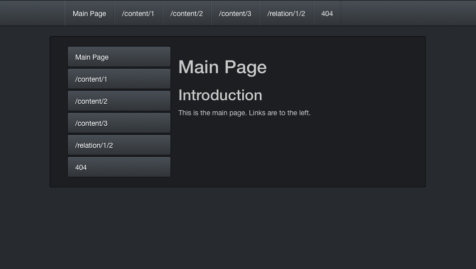

#######
lfetool
#######

.. image:: resources/images/logo-small.png

*An Erlang Lisper's Tool for Admin Tasks, Project Creation, and Infrastructure*

Introduction
============

Currently, the script supports these commands:

* ``help``
* ``version``
* ``install``
* ``update``
* ``extract``
* ``new``

Usage information for each of these is presented below.

*Note*: This project superscedes its precursor, the `lfe-skel`_ project.

Installation
============

Stable
------

Download the `shell script`_ and save it to a directory in your ``$PATH``. For
example:

.. code:: bash

    $ curl -o ./lfetool https://raw.github.com/lfe/lfetool/master/lfetool
    $ bash lfetool install /usr/local/bin

Depending upon how the permissions for your chossen path are setup, you may
need to use ``sudo``.

If you installed with ``sudo`` but would like to be able to self-update the
script in the future, you should also change the ownership:

.. code:: bash

    $ chown $USER /usr/local/bin/lfetool

Bleeding Edge
-------------

If you'd like to be able to update with the latest changes in the master branch,
you can do this instead:

.. code:: bash

    $ cd ~/lab/
    $ git clone https://github.com/lfe/lfetool.git
    $ cd lfetool
    $ ln -s ./lfetool /usr/local/bin/

Permissions are already set on the script in the repo, so there's no need to do
anything further.

Usage
=====

``help`` Command
-------------------

To display a help message:

.. code:: bash

    $ lfetool help

Optionally, you may also use a flag:

.. code:: bash

    $ lfetool -h

``version`` Command
-------------------

To get the current installed version of ``lfetool``:

.. code:: bash

    $ lfetool version

Optionally, you may also use a flag:

.. code:: bash

    $ lfetool -v

``install`` Command
-------------------

The ``install`` command supports the following sub-commands:

* ``lfetool``

* ``lfe``

* ``erlang``

* ``kerl``

* ``rebar``

* ``relx``

You may also call ``./lfetool install`` without any parameters; this is an
alias for ``./lfetool install lfetool``.

``install`` or ``install lfetool``
,,,,,,,,,,,,,,,,,,,,,,,,,,,,,,,,,,

Assuming you have downloaded ``lfetool`` to your local directory, you can use it
to install the script to a path of your choosing. Simply provide the
installation directory:

.. code:: bash

    $ ./lfetool install /usr/local/bin

or (for lovers of verbosity):

.. code:: bash

    $ ./lfetool install lfetool /usr/local/bin

You need to have write permissions to the given directory in order for this
command to succeed. Note that the installation procedure sets the executable
bit for the script.

``install lfe``
,,,,,,,,,,,,,,,

If you would like to install LFE system-wide, you may use the following command
to do so. This does assume that you have ``erl`` in your path.

.. code:: bash

    $ lfetool install lfe

If using ``kerl``, this will install LFE in the lib dir for whichever Erlang
install was most recently ``activate``ed by ``kerl``.

Installing LFE is really only justified if you will be running ``lfescript``-
based scripts. In general, we discourage system-wide LFE installations and
suggest using something like `rebar`_ or `erlang.mk`_ to pull your
dependencies into a project dir and running LFE from there.

``install erlang``
,,,,,,,,,,,,,,,,,,

This command is merely a convenience wrapper for the ``kerl`` tool and assumes
that you have ``kerl`` installed and in your ``$PATH``. It takes a single
parameter, the release name of Erlang:

.. code:: bash

    $ lfetool install erlang R16B03-1

This will install the given release of Erlang at ``/opt/erlang/R16B03-1``.
You can override the install dir by passing a different one:

.. code:: bash

    $ lfetool install erlang R16B03-1 /usr/local

To get a list of available releases, you can use the following:

.. code:: bash

    $ kerl list releases

``install kerl``
,,,,,,,,,,,,,,,,

We depend upon ``kerl`` quite heavily, and as such, we provide a means
of easily installing it:

.. code:: bash

    $ lfetool install kerl

``install relx``
,,,,,,,,,,,,,,,,

For building releases, we recommend `relx`_. We go so far as to provide a
command to install it:

.. code:: bash

    $ lfetool install relx

Note that if you don't have a recent version of ``rebar`` installed, this may
fail. We have provided a ``rebar`` isntall command for your convenience.
After installing a new version of ``rebar`` the ``relx`` install should work.

``install rebar``
,,,,,,,,,,,,,,,,,

``rebar`` is a widely used tool in the Erlang community, and one that can be
used with LFE and LFE projects. Here's how you install it:

.. code:: bash

    $ lfetool install rebar

``update`` Command
------------------

If you have a regular install (not a link to the script in a ``git clone`` dir),
you may want to use this command to get the latest script from github:

.. code:: bash

    $ lfetool update

The command takes no parameters. Note that it will fail if ``lfetool`` is not
on your ``$PATH``.

``extract`` Command
-------------------

As of version 0.2.3, ``lfetool`` runs as a compressed, self-extracting script.
This is due to the increasing number files that are embedded in it and is an
effort to reduce the download size of the script. The down-side of this is that
every time the script is run, it needs to decode a large chunk of base64 text
and then ``gunzip`` that, which takes more time.

For those who would prefer faster performance of the script, there is an option
to extract the compressed, encoded script from the self-extracting wrapper:

.. code:: bash

    $ lfetool extract

Optionally, you may also use a flag:

.. code:: bash

    $ lfetool -x

This will replace the wrapper (containing the compressed script) with an
uncompressed version of the script.

``new`` Command
---------------

For the following commands, keep in mind that Lisp functions and modules do not
use underscores by convention, but rather dashes. When naming your project,
it is recommended that you do this as well. Also note that it's probably best
to use just alphanumerica characters, dashes, and nothing else in your project
names.

The ``new`` command supports the following sub-commands:

* ``script``

* ``library``

* ``service``

* ``yaws``

``new script``
,,,,,,,,,,,,,,

To create an lfescript, simply run the following:

.. code:: shell

    $ lfetool new script my-script

``new library``
,,,,,,,,,,,,,,,

To create a "library" project, run the following:

.. code:: shell

    $ lfetool new library my-new-lib

*Note*: upon running this script, not only will your project be set up with a
skeleton, but also:

* the dependencies for your project will be downloaded to your new project's
  ``deps`` dir;

* the stubbed unit test will be run and will fail (it's stubbed to fail because
  of TDD ;-));

* the project will be set up with a newly initialized github repo; and

* the new project files will be added to the repo.

``new service``
,,,,,,,,,,,,,,,,

One may create a "service" project by running the following:

.. code:: shell

    $ lfetool new service my-new-service

This will create an LFE OTP application skeleton for your project, complete with
unit tests and an initialized git repo.

To run your new server:

.. code:: shell

    $ cd my-new-service
    $ make shell

And then:

.. code:: cl

    > (: application start 'my-new-service)
    ok
    > (: my-new-service_server test-call '"a call message")
    Call: "a call message"
    ok
    > (: my-new-service_server test-cast '"a cast message")
    ok
    Cast: "a cast message"
    >

You may also start the application ahead of time, as is done in the ``run``
target:

.. code:: cl

    $ make run
    Erlang R16B (erts-5.10.1) [source] [smp:8:8] [async-threads:10] [hipe] ...

    LFE Shell V5.10.1 (abort with ^G)
    > (: my-new-service_server test-call '"a call message")
    Call: "a call message"
    ok
    > (: my-new-service_server test-cast '"a cast message")
    ok
    Cast: "a cast message"
    >

Note that the call to start the application wasn't needed, since it was started
via a command line option in the ``Makefile``.

If you would simply like to run in daemon mode, you may do that as well with the
supplied ``daemon`` target.

``new yaws``
,,,,,,,,,,,,

The ``yaws`` command builds out a number of skeleton web projects that are
powered by the YAWS web server.

``yaws`` takes several subcommands:

* ``default`` - creates a basic, multi-module web project using the
  `exemplar`_ library for generating HTML with S-expressions.

.. XXX under development
.. * ``simple`` - creates a very simple web project with only one module.

* ``bootstrap`` - creates a `Twitter Bootsrap`_ version of the ``default``
  project.

.. XXX under development
.. * ``websocket`` - creates a project that demos YAWS websocket support via a
     simple chat deno.

.. XXX under development
   * ``rest`` - creates a RESTful service example, using the classic "coffeeshop"
     model.

Note that ``new yaws`` is an alias for ``new yaws default``; if a subcommand is not passed, the
``default`` subcommand is assumed.

Example usage:

.. code:: cl

    $ lfetool new yaws my-web-project

or

.. code:: cl

    $ lfetool new yaws default my-web-project

Another example:

.. code:: cl

    $ lfetool new yaws bootstrap my-web-project

Here is a screenshot of the lfetool demo bootstrap project:

After this, you can view your new project by executing these commands:

.. code:: bash

    $ cd my-web-project
    $ make dev

and then pointing your web browser at http://localhost:5099/.

``new e2service``
,,,,,,,,,,,,,,,,,

At a future date we will also support the e2 project in a similar fashion:

.. code:: shell

    $ lfetool new e2-service my-new-service

``tests`` Command
-----------------

The ``tests`` command supports the following sub-commands:

* ``build``

* ``unit`` and ``show-unit``

* ``integration`` and ``show-integration``

* ``system`` and ``show-system``

* ``all``

``tests build``
,,,,,,,,,,,,,,,

This will build all the eunit tests found in the current directory's (LFE
project) ``./test`` sub-directory. By convention, LFE unit tests are placed (by
the project developer) in ``./test/unit``; integration tests are placed in
``./test/integration``; and system tests are placed in ``./test/system``.

Furthermore, ``lfetool`` supports custom testing modules which may be used by
the unit tests (e.g., modules for utility functions that are only ever used
in the test modules). If you wish to create and use testing modules like these,
simply create modules in ``./test`` that are prefixed with ``testing-``.

The following command builds all of the aforementioned:

.. code:: shell

    $ lfetool tests build

``tests unit``
,,,,,,,,,,,,,,

To run the unit tests for the LFE project in the current working directory,
execute the following:

.. code:: shell

    $ lfetool tests unit

If you would like to only see the unit test modules defined for the project,
and not actually run them, execute this command:

.. code:: shell

    $ lfetool tests show-unit

``tests integration``
,,,,,,,,,,,,,,,,,,,,,

To run the integration tests for the LFE project in the current working
directory, execute the following:

.. code:: shell

    $ lfetool tests integration

If you would like to only see the integration test modules defined for the
project, and not actually run them, execute this command:

.. code:: shell

    $ lfetool tests show-integration

``tests system``
,,,,,,,,,,,,,,,,

To run the system tests for the LFE project in the current working
directory, execute the following:

.. code:: shell

    $ lfetool tests system

If you would like to only see the system test modules defined for the
project, and not actually run them, execute this command:

.. code:: shell

    $ lfetool tests show-system

``tests all``
,,,,,,,,,,,,,

To run the entire test suites the LFE project in the current working directory,
execute the following:

.. code:: shell

    $ lfetool tests all

Creating lfetool Plugins
========================

*Developing additional lfetool commands*

This section has been created for those that would like to submit patches/pull
requests to lfetool for bug fixes and/or new features. At the very least, it
should provide a means for understanding what is needed in order to add new
commands to lfetool.

Adding new commands to lfetool is as simple as creating a new plugin. One can
start by either copying an existing plugin that most closely resembles the sort
of plugin you want to create, or starting completely from scratch.

For those that wish to start from scratch, the following guidelines are
provided:

Create the Plugin
-----------------

Step 1
,,,,,,

Create a new plugin directory, filller file, and subdirectory for file
tempaltes:

.. code:: bash

    $ mkdir -p plugins/my-plugin/templates
    $ touch plugins/my-plugin/filler.sh
    $ touch plugins/my-plugin/templates/special-file.lfe

* In ``plugins/my-plugin/templates``, create all the files necessary to
  support your new command. These files should all have the same name they
  would have once added to a new project, with two exceptions:

  #. they should have a ``.tmpl`` extension, and

  #. anywhere a project name would have been used (e.g., a module), ``PROJECT``
     should be used instead.

* Note the use of of ``local varname=$n`` in other functions; to avoid name
  collisions you will want to duplicate this in your own functions.

* If you are creating a project type that has actual code, you need to add
  a test module that has at least one unit test defined. To encourage TDD,
  your unit test(s) should fail due to an intentional bug in the sample
  implementation. (See the ``library`` and ``service`` templates for two
  examples of these.)

Step 2
,,,,,,

Edit ``plugins/my-plugin/filler.sh`` to create a function named something
sensible (e.g., fill-my-plugin). This function needs to define two variables:

#. ``template`` - this should be a string value for the path to the template
   file whose template variables you want to replace (e.g.,
   ``plugins/my-plugin/templates/special-file.lfe``); and

#. ``pattern`` - this should be the placeholder text in your template that
   needs to be substituted with a value (e.g., {{NAME}}).

This function then needs to call the ``fill-tool-var`` function (defined in
``./bin/create-tool``).

If you have more than one template variable you'd like to replace, simply add
another line that defines the next ``pattern`` and then a call to
``fill-tool-var $template $pattern``.

Step 3
,,,,,,

* With the project files created, ``plugins/lfetools/templates/lfetool.tmpl``
  needs to be updated to accept the new command in the ``create-new`` function.
  You will dispatch here to a new function that will create all the required
  files for your new project type.

* Create any other functions necessary in support of your new dispatch function.

Tell ``lfetool`` about the Plugin
---------------------------------

Step 4
,,,,,,

Each ``filler.sh`` file created in ``plugins/*/``  (**Step 2**) will be be
sourced by ``./bin/create-tool``. As such, once you have created the
``filler.sh`` file for your plugin, you need to add it to the ``run``
function in ``./bin/create-tool``.

Step 5
,,,,,,

* For every file you have added to your plugin's template directory (which will
  be created by ``lfetool`` when it runs your plugin's commands), you will need
  to add a new variable at the top of
  ``plugins/lfetools/templates/lfetool.tmpl`` with a unique string of the form
  ``{{NAME}}`` which will later be substituted with actual content when
  ``./bin/create-tool`` is run.

Testing
-------

Step 6
,,,,,,

* Write a unit test in ``test/test.sh`` which checks for the existence of all
  the files you have created and examines at least some of the file contents to
  make sure they got created as expected.

* Your unit test functions will need to be in headless camel case (e.g.,
  ``testMyNewCommand``).

* Run the test suite:

.. code:: bash

    $ make check

Step 7
,,,,,,

* Build a local copy of ``lfetool`` by running ``make build``.

* Run your new command, e.g.: ``lfetool new my-new-proj-type awesome-proj-name``

* Check that all the expected files are created, that any new ``make`` targets
  work as expected.

* Submit a pull request!

.. Links
.. -----
.. _LFE rebar: hhttps://github.com/oubiwann/lfe-sample-rebar-plugin
.. _lfe-skel: https://github.com/lfe/skeleton-project
.. _shell script: https://raw.github.com/lfe/lfetool/master/lfetool
.. _exemplar: https://github.com/lfe/exemplar
.. _Twitter Bootstrap: http://getbootstrap.com/
.. _rebar: https://github.com/rebar/rebar
.. _erlang.mk: https://github.com/extend/erlang.mk
.. _relx: https://github.com/erlware/relx
